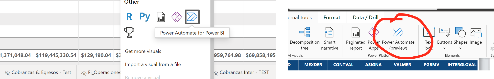

# Refresh PowerBI dataset after dataflow refresh   
Refreshing data dependencies on demand in a Power BI report: A detailed explanation of how to refresh a Dataflow and then a Dataset as a single action from a Power BI report using Power Automate   
    
Just a test caption   
There are many times when you need to refresh your data instantly. While scheduled refreshes for Dataflows and Datasets are useful, they have limitations. Additionally, you may want report users to have this flexibility without extra permissions. This can be achieved with Power Automate and a Power BI button visual, enabling a flow trigger.   
Previously, refreshes had to be done outside the report in the Power BI online UI. This could be inconvenient for users, especially if they did not have the necessary permissions.    
A better approach is enabling users, even those with only reader permissions, to refresh data directly from the report.   
The solution involves creating a Power Automate flow with the following general steps:   
- Refresh Dataflow   
- Wait for Dataflow to be refreshed   
- Refresh Dataset   
   
This flow will be triggered by a button in our Report.   
We will show the steps in PowerBI desktop. The steps are almost identical if they are done on PowerBI online.   
## Add button to Report   
Open menu of visuals and add "Power Automate for PowerBI" visual.  Or add it directly from the menu bar.   
    
   
    
Adding Power Automate visual   
When you open this visual, it will display a series of steps to guide you through adding a flow.   
   
    
Steps to add a flow   
For this example, point 1 is not necessary, so let's begin by creating a flow   
## Create flow    
To create the flow, click on the three dots on the visual and select 'Edit.' An embedded window will open, displaying a bar with the '+New' menu. Click on it and choose 'Instant cloud flow.'    
This action initiates a new flow with the first step, related to pressing the button in the report, already created. Here, you can add steps to refresh the Dataflow and Dataset.    
Click on 'Untitled' and name your flow, such as 'Refresh Backend Data   
    
### Refresh dataflow   
Click on the 'New Step' button, search for 'Dataflow,' and add the action titled 'Refresh a dataflow.' Then, fill in the inputs by selecting your workspace and dataflow names from the dropdown menus.   
    
    
Now, let's add a step to wait for the completion of the previous action and capture its results. Use the step titled 'When a dataflow refresh completes.' Search for it and fill in the necessary inputs.   
    
Next, we add a conditional step to verify that everything worked correctly. If so, we proceed to add the step to refresh the dataset.    
To do this, search for the 'Condition' action and add it   
    
Now, select the outcome of the previous action and verify that it was successful.   
    
This control enables you to add different actions based on whether the check's result is true or false. In our scenario, if the result is 'Success,' we then add the 'Refresh a dataset' action similarly to the previous steps. Optionally, you can include an action for failure scenarios, such as sending an email or notifying the flow's owner.   
   
### Refresh a Dataset   
After completing the previous step, we can proceed to add actions under 'If Yes' and 'If No.' In our scenario, under 'If Yes,' we simply add the 'Refresh a dataset' action.   
    
In the event of a failure, you have the option to capture this outcome and send an email, notification, or any other relevant action. This step is optional, of course.   
    
### Save and Apply the Flow   
Finally click on the 'Save' option in the top left menu and select 'Save and apply.' Now, you should have a button with a fully functional Flow attached to it.   
   
### Format button.   
There are numerous options available for formatting the button to your liking. While I won't go into details, the process is quite straightforward and user-friendly.   
    
### Check flow by reviewing Refresh histories   
After clicking the 'Refrescar' (or any name you may have used) button, I checked the Refresh History for the Dataflow and Dataset in the Power BI Service. There, you should see the refresh type listed as 'On Demand.' If you open these windows quickly enough, you should observe that they are in progress—first the Dataflow and, once it's finished, then the Dataset.   
    
   
**Note**:  It's advisable to collaborate with your IT team to set up a Service Account or use Azure Active Directory App Authentication. 
Service Accounts help avoid disruptions in workflows and automations that can occur due to routine updates in your personal Microsoft 365 account, like password changes. These updates can break automated Power BI dataset refreshes, necessitating re-login.    
I won't delve into the specifics of this advanced identity/authorization setup here. However, recognizing its importance in preventing refresh disruptions due to password changes, I plan to write a detailed article on how to configure this, or at least guide you on requesting assistance from your IT department.   
### Conclusion   
We've explored how to initiate a Power Automate flow from a Power BI report, a particularly useful process as it allows for refreshing the dependent components of our report in sequence—starting with a Dataflow, followed by its dependent Dataset.    
This setup can serve as a foundation for more complex or varied scenarios, tailored to the specific requirements of a project. For example, instead of manual initiation, you could configure a scheduler to trigger the process.   
